# DASC7606 Final - BERT - summarized by hyperloop

# Section 0 Exam Scope

---

# Section 1 Architecture and Pre-training
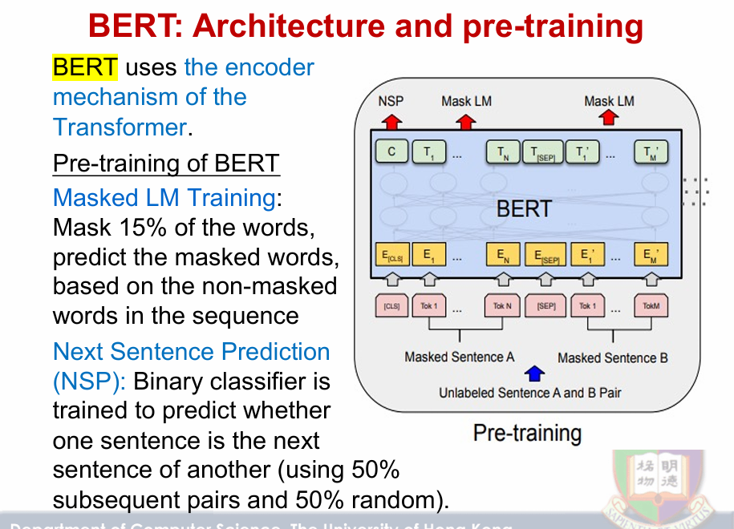

## BERT架构与预训练

- BERT使用了Transformer的编码器机制。
- 预训练包括：
  - **Masked LM**：掩码15%的词，根据非掩码的词预测被掩码的词。
  - **Next Sentence Prediction**：训练二分类器预测一个句子是否是另一个句子的下一句，使用50%的后续句子对和50%的随机句子对。

---
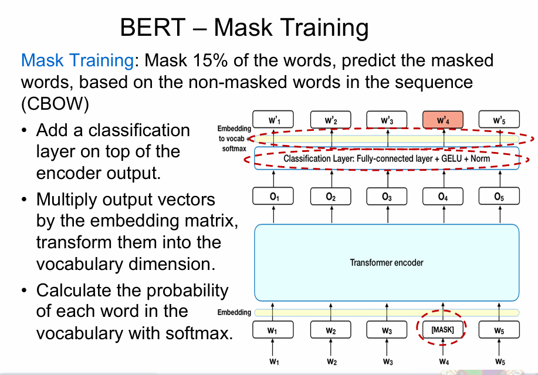

## BERT掩码训练与优势

- **掩码训练**：掩码15%的词，预测被掩码的词，类似CBOW模型。
- **分类层**：在编码器输出上加一个分类层（全连接层+GELU+Norm）。
- **向量变换**：输出向量与嵌入矩阵相乘，转换到词汇表维度。
- **概率计算**：使用softmax计算每个词的概率。

---

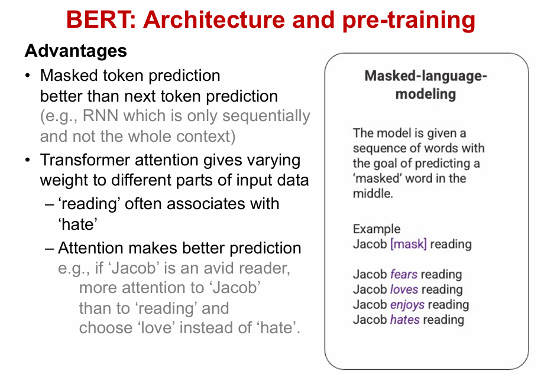

## 优势：
- **掩码词预测优于下一个词预测**，如与RNN相比，RNN只考虑序列而非整体上下文。
- **Transformer的注意力机制**：对输入数据的不同部分赋予不同的权重，有效提升预测准确性。

---

# Section 2 Next Sentence Prediction

## BERT训练：下一句预测（Next Sentence Prediction，NSP）

- **输入句子对**：在每个句子的开头插入[CLS]标记，结尾插入[SEP]标记。
- **学习目标**：判断第二个句子是否是第一个句子的后续。
- **数据集**：50%是连续句子对，另外50%是随机句子对。
- **分类层**：使用简单的分类层计算句子对是否为后续关系的概率，采用Softmax进行计算。
- **NSP的应用**：NSP用于处理基于句子间关系的任务。
  
## RoBERTa优化
- RoBERTa（一种优化的BERT方法）通过动态掩码和不使用下一句预测任务来利用更多数据进行训练。

---

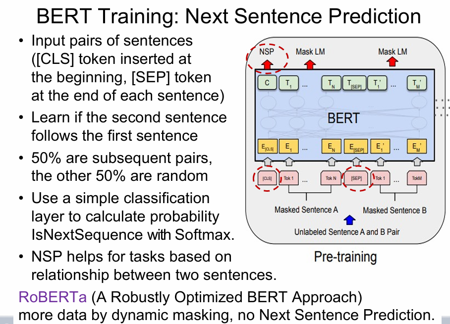
## BERT训练：下一句预测（Next Sentence Prediction，NSP）

- **输入句子对**：在每个句子的开头插入[CLS]标记，结尾插入[SEP]标记。
- **学习目标**：判断第二个句子是否是第一个句子的后续。
- **数据集**：50%是连续句子对，另外50%是随机句子对。
- **分类层**：使用简单的分类层计算句子对是否为后续关系的概率，采用Softmax进行计算。
- **NSP的应用**：NSP用于处理基于句子间关系的任务。
  
## RoBERTa优化
- RoBERTa（一种优化的BERT方法）通过动态掩码和不使用下一句预测任务来利用更多数据进行训练。

---

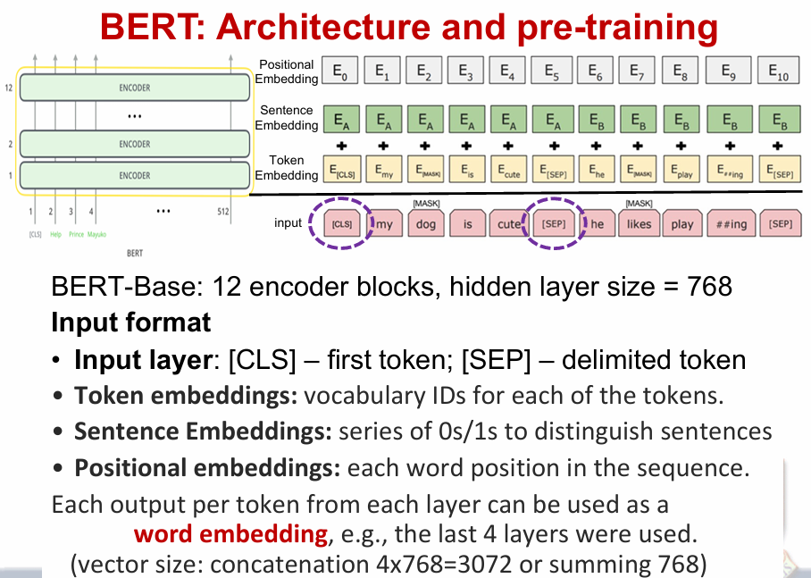
## BERT架构与预训练

BERT-Base模型包含12个编码器块，隐藏层大小为768。

## 输入格式：
- **输入层**：[CLS]为第一个token， [SEP]为分隔符。
- **Token嵌入**：每个token的词汇ID。
- **句子嵌入**：用一系列的0/1来区分不同的句子。
- **位置嵌入**：表示每个单词在序列中的位置。

## 输出：
每个token在每一层的输出可以用作**词嵌入**，例如：使用最后4层的输出，进行拼接（向量大小为4x768=3072或768）。

---

# Section 3 BERT for Word Embeddings
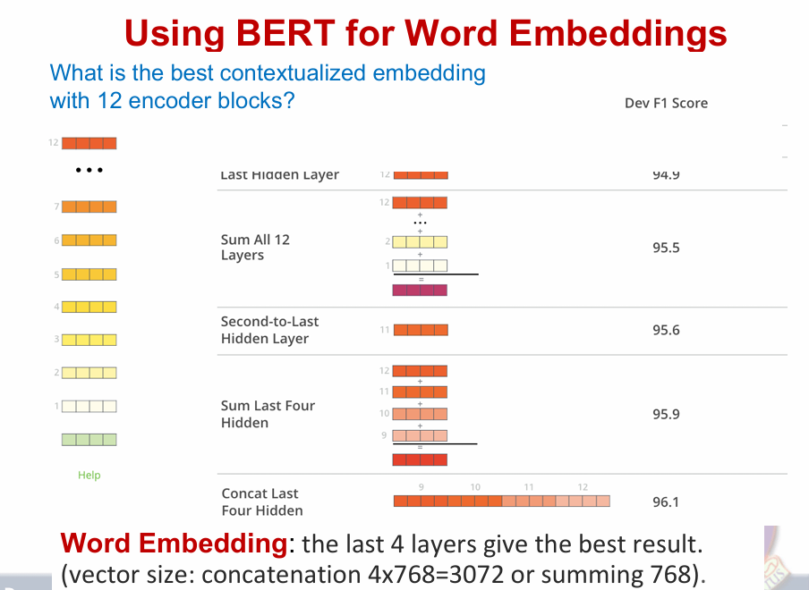
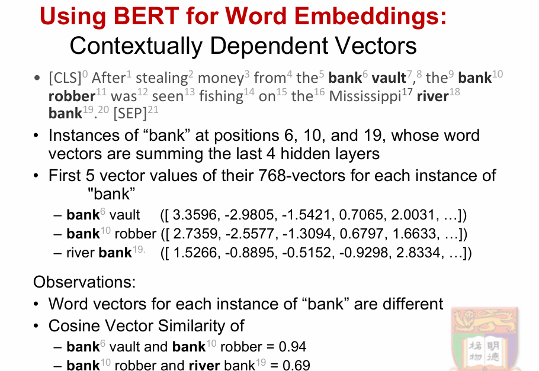
## 使用BERT进行词嵌入

## 最佳上下文化嵌入
- **最后四层**：最后四层的输出结果给出了最好的词嵌入，拼接得到的向量大小为4x768=3072，或者也可以选择求和768。
  - **F1分数**：最后四层拼接的F1分数为96.1。

## 上下文化的词向量
- **“bank”**在不同位置的词向量：
  - **bank**在位置6、10、19处的向量，使用了最后四层的嵌入。
  - **向量例子**：
    - **bank**（位置6，vault）：[3.3596, -2.9805, -1.5421, 0.7065, 2.0031, ...]
    - **bank**（位置10，robber）：[2.7359, -2.5577, -1.3094, 0.6797, 1.6633, ...]
    - **river bank**（位置19）：[1.5266, -0.8895, -0.5152, -0.9298, 2.8334, ...]

## 观察
- **词向量的差异**：每个“bank”的词向量不同。
- **余弦相似度**：
  - **bank vault**与**bank robber**的余弦相似度为0.94。
  - **bank robber**与**river bank**的余弦相似度为0.69。

---

# Section 4  BERT for other NLP tasks

## 使用BERT进行其他NLP任务（微调）

BERT可以用于多种语言任务，只需在核心模型上添加一个小的分类层。

## 微调训练
- 微调训练中，大部分超参数与BERT训练相同。

## 分类任务
- 任务类型：单句情感分析、推理、语义相似度等。
- **输入格式**：输入句子以[CLS]开始，以[SEP]结束。
- **分类层**：在[CLS]的隐藏状态上添加分类层，维度为 K x H，其中：
  - K = 分类标签数量
  - H = 隐藏层大小
- **标签概率计算**：使用标准的softmax计算标签概率。
---

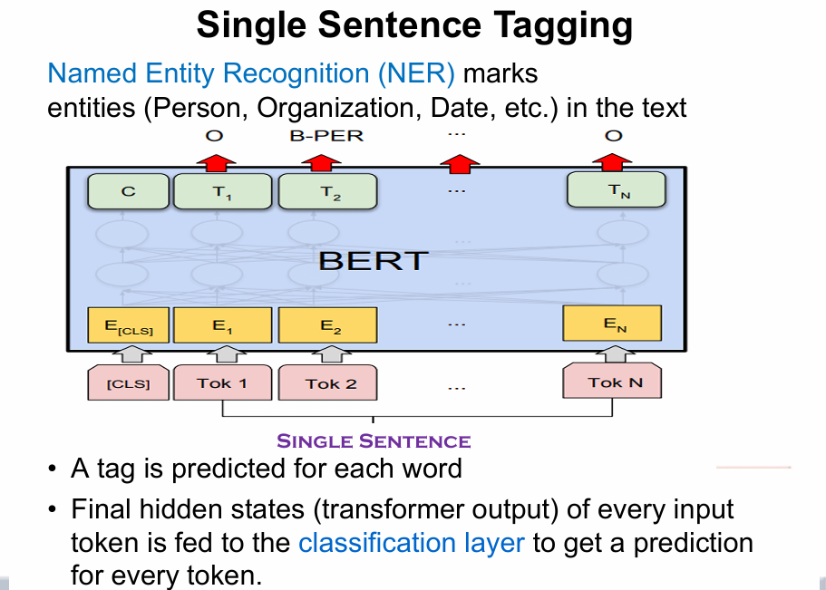
## 单句标注

**命名实体识别（NER）**：在文本中标记实体（如人名、组织名、日期等）。

## 输入格式
- **每个词都要预测一个标签**。
- **最终隐藏状态**（Transformer输出）作为每个输入token的表示，传递给分类层来为每个token生成预测。

## 示例
- 输入：**[CLS] John went to the store on Monday [SEP]**
- 输出：每个token会有一个相应的标签（如B-PER表示人名实体，O表示其他）。

---

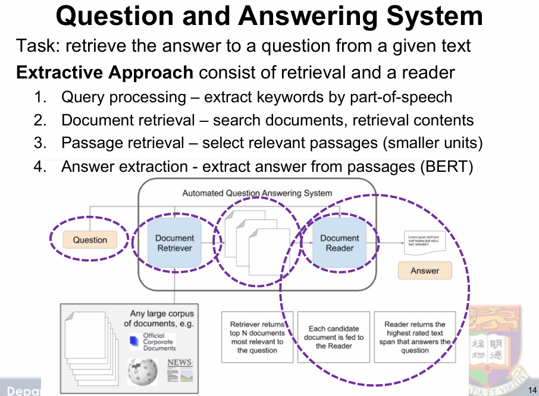
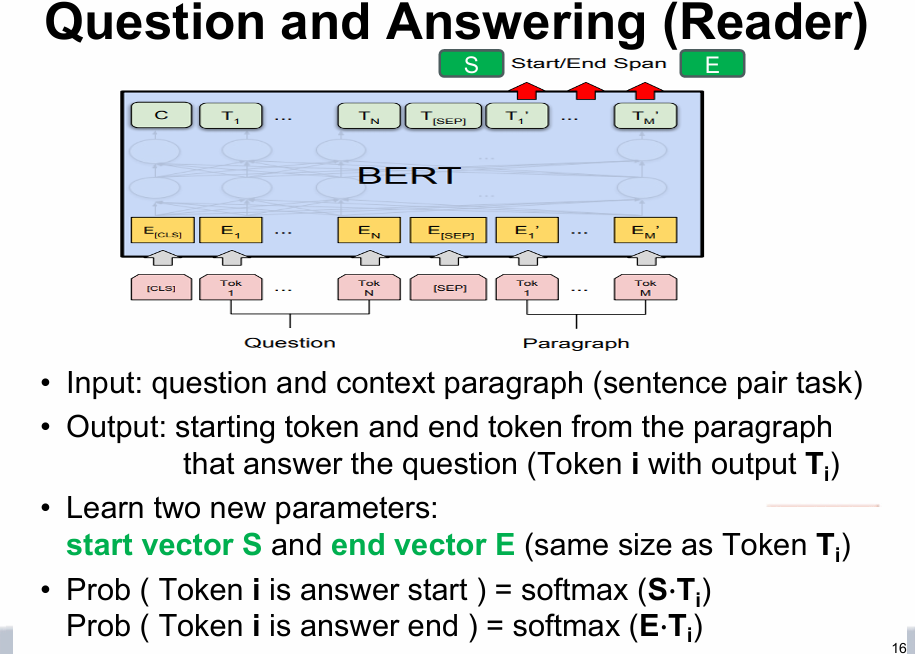
## 问答系统（Question and Answering System）

## 任务：从给定文本中检索问题的答案

**提取式方法**（Extractive Approach）包括检索和阅读器：
1. **查询处理**：通过词性提取关键词。
2. **文档检索**：搜索文档并检索相关内容。
3. **段落检索**：选择相关段落（更小的单位）。
4. **答案提取**：从段落中提取答案（使用BERT）。

## 系统流程：
- 输入：问题和上下文段落（句子对任务）。
- 输出：从段落中获取答案的起始和结束token。

## BERT应用：
- 学习两个新参数：**起始向量S**和**结束向量E**（与Token Ti的大小相同）。
- 概率计算：  
  - 计算答案开始的token：**Prob(Token i is answer start) = softmax(S · Ti)**
  - 计算答案结束的token：**Prob(Token i is answer end) = softmax(E · Ti)**

## 示例：
- 问题1：**What group in the periodic table is oxygen a member of?**
- 问题2：**What is the atomic number of oxygen?**
- 问题3：**Is oxygen abundant?**

BERT从上下文中提取相关信息并准确回答问题。

---

# Section 5 Tokenization

## 什么是Tokenization？
Tokenization是将一个词、短语、句子、段落或文本拆分成更小的单元（如句子、词、字符级的token化）。

## 子词Tokenization
- **子词Tokenization** 是介于基于词和基于字符的token化之间的平衡方法，它基于词的频率和结构将词拆分成更小且有意义的部分（如Byte-Pair或WordPiece Tokenization）。
- **示例**：
  - 词汇“embeddings” → ['em', '##bed', '##ding', '##s']
  - `##` 表示前一个子词的前缀

---

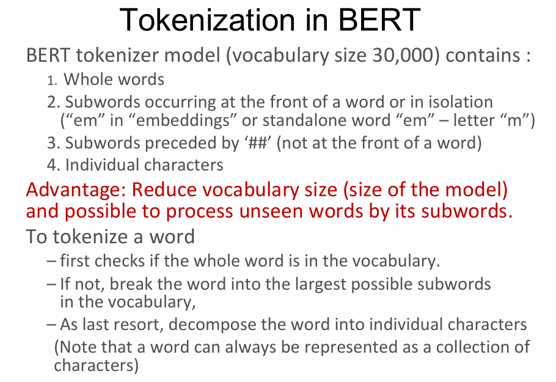

## BERT中的Tokenization
BERT的tokenizer模型（词汇大小30,000）包含以下类型：
1. **整个词**。
2. **出现在词首或独立的子词**（如“em”在“embeddings”中的情况）。
3. **以‘##’开头的子词**（表示词中的部分部分）。
4. **单个字符**。

### 优势：
- **减少词汇表的大小**（减小模型的大小）。
- 通过子词处理未见过的词。

### Tokenize一个词的步骤：
1. 首先检查整个词是否在词汇表中。
2. 如果没有，将词分解成词汇表中最大可能的子词。
3. 如果以上步骤无效，最终将词分解为单个字符。

> 注意：任何词都可以始终表示为一个字符集合。

