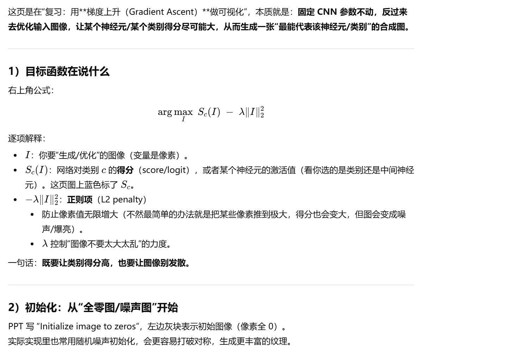
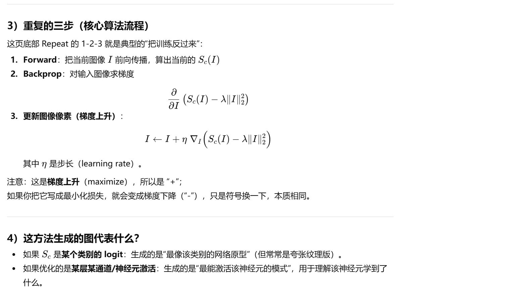
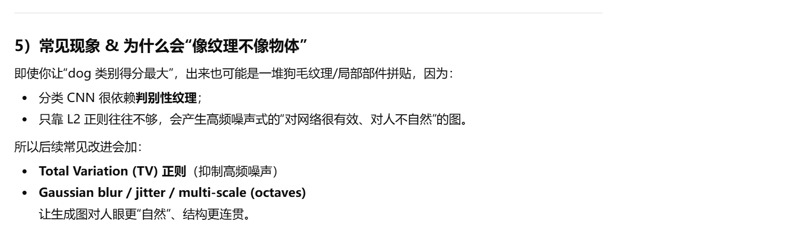

# DASC7606 Final - Deep Generative Models - summerized by hyperloop

# Section 0 Exam Scope

---

# Section 1 Deep Dream Generator

### DeepDream（深度梦境）核心思想

- **定义**：一种“模式增强”程序：用训练好的 CNN 在图片中寻找它识别到的特征模式，并通过修改图片把这些模式放大/强化。
- **基本设置**：
  - 选择一张输入图像 \(I\) 和一个已训练好的 CNN（用于分类等任务）。
  - 令 \(f_x^{(L)}(I)\) 表示：当输入为 \(I\) 时，第 \(L\) 层神经元 \(x\) 的激活值。
- **优化目标**：通过改变输入图像，使选定神经元/层的激活最大化：
  \[
  \max_I \; f_x^{(L)}(I)
  \]
- **怎么做（流程）**：
  1. **固定 CNN 权重不变**（不训练网络，只改图片）。
  2. 从输入 \(I\) **前向传播**到第 \(L\) 层，得到激活值。
  3. 将目标激活对输入图像做 **反向传播**，得到 \(\nabla_I f_x^{(L)}(I)\)。
  4. 用**梯度上升**更新图像，让目标激活更大（重复多次）。
- **结果直观**：图片中会出现/被强化网络偏好的纹理、形状和语义碎片，看起来像“把网络脑海里的特征投影到图像上”。

---

###  梯度上升（Gradient Ascent）做可视化

---

# Section 2 Generative Adversarial Network
## 2.1 Basis of GAN

### 生成对抗网络（GAN, Generative Adversarial Network）

- **VAE 的问题**：VAE 生成新数据时往往偏“模糊”，因为它学到的是数据的**平均化表示**（averaged representation），输出容易被“抹平细节”。
- **GAN 含义拆解**
  - **Generative（生成）**：学习一个**生成模型**，能从噪声/潜变量中产生新样本。
  - **Adversarial（对抗）**：在**对抗训练**框架下训练（通常是生成器 G vs 判别器 D，互相博弈提升）。
  - **Networks（网络）**：使用**深度神经网络**实现生成与判别。
- **直观目标**：让生成样本越来越“像真数据”，使判别器越来越难分辨真假。
- **图示问题**：PPT 中间标注“computer generated”，对应该示例里被标注为**计算机生成**的那张图（用于说明“真假难辨”）。

---

### 生成对抗网络（GANs）的训练机制（核心思想）

- **训练像一场“博弈/游戏”**：由两个彼此独立的网络共同训练
  - **生成器（Generator, G）**
  - **判别器（Discriminator, D）**
- **判别器 D 的任务（Real or Fake）**  
  - 输入：**真实数据**（actual data）+ **生成数据**（generated data）
  - 输出：判断样本来自**真实分布 R**，还是来自生成器的**模型分布 F**
  - 目标：尽可能把“真/假”分对（提高判别准确率）
- **生成器 G 的任务**  
  - 生成“看起来像真的”样本（generated data）
  - 目标：让 D 误判为真（**欺骗判别器**）
- **整体效果**  
  - D 越强 → 逼 G 生成得更逼真  
  - G 越强 → D 越难分辨  
  - 最终希望：生成分布 F 逐渐接近真实分布 R

---

### GAN（生成对抗网络）工作流程（从噪声到对抗训练）

- **输入两路样本给判别器 D**
  1) **真实样本**：从真实数据集采样得到 \(x\)，送入判别器，输出  
     \[
     D(x)\in[0,1]
     \]
     表示“判为真实”的概率/置信度（越接近 1 越像真）。
  2) **伪造样本**：先从随机变量（噪声）采样 \(z\)，经生成器得到  
     \[
     \hat{x}=G(z)
     \]
     再送入判别器，输出  
     \[
     D(G(z))\in[0,1]
     \]
     越接近 0 表示越像假。

- **两者的目标（对抗）**
  - **判别器 D**：尽量区分真/假  
    - 希望 \(D(x)\to 1\)，\(D(G(z))\to 0\)
  - **生成器 G**：尽量“骗过”判别器  
    - 希望 \(D(G(z))\to 1\)

- **Loss 的直观含义**
  - D 的损失：鼓励“真给高分、假给低分”
  - G 的损失：鼓励“让假样本也拿高分”（让 D 以为真）

- **训练方式**
  - 交替更新：固定 G 训练 D；再固定 D 训练 G
  - 彼此对抗迭代，最终得到更强的生成器和判别器（生成分布逐渐逼近真实分布）。

---

## 2.2 Training the GAN

### GAN 示例（以“椅子图片”为例）+ 训练时参数如何更新

- **真实数据分布 Q / R**
  - 从真实数据集采样得到图片 \(x \in \mathbb{R}^{n\times n}\)（例：真实椅子图）。
- **生成数据分布 F**
  - 从噪声采样 \(z\)，经生成器得到假样本 \(G(z)\in F\)（例：生成的椅子图）。

- **判别器输出含义**
  - \(D(x)\in[0,1]\)：判别器认为输入为“真实”的概率/置信度  
    - 越接近 1 → 越像真；越接近 0 → 越像假

- **谁的权重会被更新？（直观规则）**
  - **真实样本 \(x\) 应该被判为真**
    - 若 \(D(x)=0\)（把真判成假）→ **更新判别器 D 的权重**（让它更会认“真”）
  - **假样本 \(G(z)\) 应该被判为假**
    - 若 \(D(G(z))=1\)（把假判成真）→ **更新判别器 D 的权重**（让它更会识别“假”）
    - 若 \(D(G(z))=0\)（假被识别出来）→ **更新生成器 G 的权重**（让它生成得更像真）
  - **通常 \(D(G(z))\in(0,1)\)**：真假难分但还没到位 → **D 和 G 都需要通过各自的 loss 被更新**  
    - 黄框：Discriminator loss / Generator loss 分别驱动 D、G 往各自目标优化

- **训练终点（理想平衡）**
  - 当判别器（最优时）**无法区分真/假**：对任意输入都接近
    \[
    D(\cdot)\approx 0.5
    \]
  - 此时说明：生成样本已经很像真实样本，即 **\(F \approx R\)**（生成分布逼近真实分布）

---

### 训练判别器（Training the Discriminator, 更新 D）

- **使用真实样本 + 生成样本共同训练**：
  - 真实样本 \(x\)（label=1），希望 \(D(x)\to 1\)
  - 生成样本 \(\hat{x}=G(z)\)（label=0），希望 \(D(G(z))\to 0\)
- 通过 **反向传播（BP）更新 D 的参数**，使其分类更准。
- 目标：**最小化分类错误**（或等价最大化判别对数似然）。
- 常用判别器损失：
  \[
  L_D = -\mathbb{E}_{x\sim R}[\log D(x)] - \mathbb{E}_{z}[\log(1-D(G(z)))]
  \]

### 训练生成器（Training the Generator, 更新 G）

- **冻结判别器 D 的参数**（Fix the weights of Discriminator）：训练这一步只更新 **G**。
- 从噪声采样 \(z\)，生成假样本 \(\hat{x}=G(z)\)（artificial instance）。
- 将 \(\hat{x}\) 输入 D 得到 \(D(G(z))\in[0,1]\)。**G 的目标**：让 D 认为它是真的  
  \[
  \text{希望 } D(G(z)) \to 1
  \]
- 通过 **反向传播（BP）**：梯度从 D 的输出传回到 G（D 不更新，但提供梯度信号），从而调整 G，使生成分布 \(F\) 更接近真实分布 \(R\)。
- 等价直觉：**最大化判别器的错误**（让 D 更容易被“骗”）。
- 常用生成器损失（非饱和形式更稳定）：
  \[
  L_G = -\mathbb{E}_{z}[\log D(G(z))]
  \]
  
### 一句话总结（交替训练）
- **训练 D：** 学会分清真/假  
- **训练 G：** 学会生成“以假乱真”的样本  
- 两步交替迭代，直到 D 越来越难分辨，生成结果越来越逼真。

---

### GAN 训练目标（Minimax 目标函数）

- **整体目标**（生成器最小化，判别器最大化）：
  \[
  \min_G \max_D \Big( \mathbb{E}_{x\sim R}[\log D(x)] + \mathbb{E}_{z\sim Z}[\log(1 - D(G(z)))] \Big)
  \]
  - \(x\sim R\)：从真实数据分布取样  
  - \(z\sim Z\)：从噪声分布取样  
  - \(D(x)\)：判别器认为“为真”的概率

### 用随机梯度下降（SGD）进行交替训练（for k steps）

#### 1) 训练判别器 D（固定 G，**最大化**目标：梯度上升）
- 采样 \(m\) 个噪声：\(\{z_1,\dots,z_m\}\)，生成假样本 \(G(z_i)\)
- 采样 \(m\) 个真实样本：\(\{x_1,\dots,x_m\}\)
- 更新 D：对下面的目标做 **gradient ascent**（上升 = maximize）
  \[
  \nabla_{\theta_D}\frac{1}{m}\sum_{i=1}^{m}\Big[\log D(x_i)+\log(1-D(G(z_i)))\Big]
  \]
  **直觉**：让真样本得分高、假样本得分低。

#### 2) 训练生成器 G（固定 D，**最小化**目标：梯度下降）
- 再采样 \(m\) 个噪声：\(\{z_1,\dots,z_m\}\)，得到假样本 \(G(z_i)\)
- 更新 G：对同一表达式中与 G 相关的部分做 **gradient descent**（下降 = minimize）
  \[
  \nabla_{\theta_G}\frac{1}{m}\sum_{i=1}^{m}\Big[\log D(x_i)+\log(1-D(G(z_i)))\Big]
  \]
  **关键点**：\(\log D(x_i)\) 与 G 无关（可视为常数），G 实际是在最小化
  \(\log(1-D(G(z)))\)，也就是推动 \(D(G(z))\) 变大（更像真）。

### 一句话记忆
- **D：梯度上升** → “把真判真、把假判假”  
- **G：梯度下降** → “让假样本骗过 D（让 \(D(G(z))\to 1\)）”

---

## 2.3 Problems in GAN

### GAN 存在的问题

- **模式崩塌（Mode Collapse）**：生成器倾向只生成少数几类样本，覆盖不了真实数据的多峰分布，**多样性差**。
- **不收敛 / 训练不稳定（Non-convergence / Instability）**：GAN 是零和极小极大博弈，训练容易**震荡**、难以稳定达到平衡点。
- **生成失真 / 伪影（Distorted figures / Artifacts）**：生成结果可能出现**结构错误**或**局部纹理伪影**（形状扭曲、细节怪异等）。

### Common Issues in GANs 

- **Mode collapse**: the generator produces only a few output modes and fails to cover the multi-modal real data distribution (**low diversity**). 
- **Non-convergence / training instability**: the minimax, zero-sum game can **oscillate** and be difficult to stabilize to an equilibrium.
- **Distorted outputs / artifacts**: generated samples may contain **structural distortions** and **visual artifacts** (warped shapes, incorrect parts, odd textures).

---

# Section 3 Conditional-GAN

### 条件生成对抗网络（Conditional GAN / cGAN）

- **GAN 的弱点**
  - 难以按“目标标签/类别”生成指定类型的数据（缺乏可控性）
  - 生成数据可能**多样性不足**

- **核心问题**：如何控制生成图像的类型/类别？

- **思路：加入条件标签 \(N\)**（Mirza & Osindero, 2014）
  - **给生成器 G**：把标签 \(N\) 与噪声 \(z\) 一起作为输入，使其生成指定类别样本  
    \[
    \hat{x}=G(z, N)
    \]
  - **给判别器 D**：把标签 \(N\) 与样本 \(x\) 一起作为输入，帮助更好地区分真/假  
    \[
    D(x, N)\in[0,1]
    \]

- **训练结果**
  - G 与 D 都“以 \(N\) 为条件”（conditioned on \(N\)）进行对抗学习
  - 训练好后：可以按给定标签生成对应类别图像（如指定数字、指定衣物类型）

- **重要限制**
  - **不是完全无监督**：需要带标签的数据（需要 label）

---

### C-GAN（条件 GAN）结构要点（C-GAN Architecture）

- **输入与输出**
  - 随机噪声/潜变量：\(z\)（latent vector）
  - 条件标签：\(N\)（label，通常用 **one-hot** 表示）
  - 生成器输出：条件生成样本  
    \[
    \hat{x}=G(z\mid N)
    \]
  - 判别器输出：在给定条件 \(N\) 下判断真伪  
    \[
    D(x\mid N)\in[0,1]
    \]

- **整体流程（与 GAN 的区别）**
  - 真实样本 \(x\) 与标签 \(N\) 一起送入判别器：判断“在标签 \(N\) 条件下是否真实”
  - 生成器用 \((z, N)\) 生成 \(\hat{x}\)，再将 \((\hat{x}, N)\) 送入判别器

- **关键实现方式：如何把标签 \(N\) 融入网络**
  - **Generator（G）侧**
    - 将标签 \(N\)（one-hot）先通过 **embedding layer** 映射成向量
    - 再与噪声 \(z\) **拼接（concatenate）**，形成用于生成图像的条件潜向量
  - **Discriminator（D）侧**
    - 将标签 \(N\) 也通过 **embedding layer** 映射
    - 常见做法：把 embedding **扩展/reshape 到与图像同尺寸**（same size as image）
    - 再与输入图像在通道维度 **拼接**，帮助 D 在条件 \(N\) 下更好地区分真/假

- **直观理解**
  - \(z\) 决定“随机变化/细节”，\(N\) 决定“类别/类型”
  - 因为 \(z \to G(z)\) 的映射很复杂，引入条件 \(N\) 可以让生成结果更可控、更符合目标类别

---

# Section 4 Adversarial Images

## 对抗样本 / 对抗图像（Adversarial Images / Examples）

- **定义**：对输入图像施加**很小但经过刻意设计的扰动**（perturbation），让神经网络产生**错误分类**，甚至给出**更高置信度**的错误结果。
- **经典现象（Panda → Gibbon）**：  
  原图被判为“panda”，加入极小扰动 **+ ε** 后，人眼几乎看不出变化，但模型却以很高置信度把它判成“gibbon”。

### 关键特征
- **扰动很小/近似不可见**：像素级噪声幅度很低，但能显著改变模型输出。
- **有目的性**：扰动不是随机噪声，而是“朝着让模型出错的方向”设计出来的。
- **高置信度误判**：对抗样本常让模型“错得很自信”（confidence 反而更高）。

### 人 vs CNN 的差异（直观理解）
- **人类**：更偏向用“抽象语义特征”识别（如熊猫：黑耳朵、黑眼圈、白色头部等）。
- **CNN/模型**：可能依赖大量**细碎的统计模式/纹理线索**；在高维输入空间中，微小改变也可能跨过决策边界，从而导致误判。

---

## 为什么要研究对抗样本（Why interested in Adversarial Examples?）

- **核心原因**：对抗样本会让机器学习模型在真实世界中**容易被攻击/欺骗**（vulnerable to attacks），从而带来安全与可靠性风险。

### 典型风险场景
- **自动驾驶 / 交通标志识别**
  - 经过轻微“伪装/扰动”的停止标志对人类仍像 stop sign，
  - 但可能被识别系统误判为“其他标志”，导致车辆**忽略停车**。

- **垃圾邮件检测**
  - 垃圾邮件内容被刻意设计得更像正常邮件（绕过特征），
  - 使模型**未能判为 spam**，从而欺骗收件人。

- **机场安检（基于ML的行李扫描）**
  - 攻击者可能通过对物体外观/特征做针对性设计，
  - 让系统把危险物品**误判为普通物品**（例如把刀误判成雨伞），造成安检漏检风险。

### 小结
- 研究对抗样本的目的：提升模型的**鲁棒性（robustness）**、**安全性（security）**与**可信可靠性（reliability）**。

---

## 白盒攻击：FGSM（Fast Gradient Sign Method）

- **白盒攻击（White-box attack）**：攻击者知道模型结构与参数/梯度信息，目标是让模型**稳定地产生误分类**。
- **FGSM思想**：利用损失函数对输入图像的梯度，沿着“让损失增大最快”的方向，对输入加一个**很小的扰动**，从而得到对抗样本（最大化损失 J）。

### 公式
- 对抗样本：
  \[
  x_{adv} = x + \epsilon \cdot \text{sign}(\nabla_x J(\theta, x, y))
  \]
  - \(x\)：原始图像
  - \(x_{adv}\)：对抗图像
  - \(J(\theta, x, y)\)：损失函数（用真实标签 \(y\) 计算）
  - \(\nabla_x J\)：损失对输入图像 \(x\) 的梯度（告诉你改哪些像素最能让模型变差）
  - \(\text{sign}(\cdot)\)：取梯度符号（每个像素只取 +1 / -1 的方向）
  - \(\epsilon\)：扰动强度/步长（控制扰动幅度，保证“看起来变化很小”）

### 直观理解（对应图中标注）
- **Original image x**：原图
- **Gradient w.r.t image x**：对输入求梯度，找“最能增加损失”的方向
- **sign to maximize loss**：取符号，相当于做一次“梯度上升”(maximize loss)
- **Multiplier ε**：缩放扰动，确保扰动小但有效
- **Adversarial image**：最终生成的对抗图像 \(x_{adv}\)

### 一句话总结
- FGSM = “用一次梯度的符号方向 + 小步长 ε”，快速构造让模型更容易犯错的输入。

---

## 生成“指定目标”的对抗样本（Targeted Adversarial Example）

### 基本流程
1. 从一张输入图像 **x** 开始（像素向量）。
2. 选择一个你想让模型输出的**目标类别 y**（designated outcome / target label）。
3. 寻找一个很小的扰动 **r**（对 x 的改动），使得 **x+r** 会被模型判成目标类别 y。
4. 不断迭代更新 r，直到模型被 **x+r** 欺骗成功（得到对抗样本）。

### 优化目标（核心公式）
- 通过优化 r（通常用梯度下降）最小化：
  \[
  \min_{r}\; \text{loss}(f(x+r),\, y) + c\cdot |r|
  \]

### 各项含义（对应图中标注）
- **r = changes made to x**：r 表示对原图 x 的扰动/修改量。
- **loss(f(x+r), y)**：
  - 衡量对抗图像 **x+r** 的预测结果与**目标类别 y** 的距离/差异  
  - 越小表示越“像 y”（越容易被判成 y）。
- **|r|（扰动大小）**：
  - 表示对抗图像与原图之间的距离（改动幅度）
  - 约束 r 不能太大，保证“人眼看起来差不多”。
- **c（权衡系数）**：
  - 控制“欺骗成功”与“扰动尽量小”之间的 trade-off  
  - c 越大越强调扰动小；c 越小越强调更快达成目标分类。

### 一句话总结
- **Targeted attack**：不是随便让模型错，而是让模型“按你指定的类别 y 去错”，同时让改动 r 尽可能小。

---

# Section 5 Adversarial Example on Other Model

## 对抗样本问题只存在于神经网络吗？

- **不是**。很多其他机器学习模型（如线性模型、SVM、k-NN 等）也能被类似方式欺骗（fooled）。
- **跨模型可迁移性（transferability）**：  
  可以先用某一种“源模型/源方法”（source technique，例如决策树 DT）生成对抗样本，再用它去攻击另一种“目标模型/目标方法”（target technique，例如 kNN），依然可能成功。

### 图表如何读（矩阵含义）
- 行：**源模型技术**（用它来生成对抗样本）
- 列：**目标模型技术**（被攻击/被欺骗的分类器）
- 每个格子里的数字：表示目标模型被欺骗的**概率**（probability being fooled）  
  **数值越低越好**（越不容易被攻击，鲁棒性更强）。

### 重要结论
- 对抗样本具有一定的**跨技术迁移**现象：DNN、逻辑回归（LR）、SVM、决策树（DT）、kNN 之间都可能互相“传递”攻击效果。
- 从图中结论：**DNN 往往是最难被欺骗的**（整体上更鲁棒/更不容易被 fool）。

---

## 使用对抗样本进行训练（Adversarial Training）

- **做法**：训练时对每一张干净图像 x，生成对应的对抗图像 x_adv，并把它**仍然标注为原来的类别**（same class），一起加入训练集。
  - 直观：让模型在训练阶段就“见过”被攻击后的样子，从而学会更鲁棒的特征。

### 图中曲线含义
- **Train=Clean, Test=Clean**：用干净数据训练，用干净数据测试（正常情况）。
- **Train=Clean, Test=Adv**：干净训练，但用对抗样本测试（容易被攻击，错误率高）。
- **Train=Adv, Test=Clean**：用对抗样本训练，但在干净数据上测试（通常还能保持不错性能）。
- **Train=Adv, Test=Adv**：用对抗样本训练，用对抗样本测试（鲁棒性提升后，错误率明显下降）。

### 关键结论（对应 PPT 提示）
- **对抗训练有效**：相比“干净训练 + 对抗测试”（绿线），
  “对抗训练 + 对抗测试”（浅蓝线）表现更好 —— 说明模型能**抵抗你训练时使用的同类攻击**。
- 本质上是提升模型对特定扰动/攻击方式的**鲁棒性（robustness）**。
