# DASC7606 Final - LLM & GPT - summarized by hyperloop

# Section 0 Exam Scope

---

# Section 1 NLP & LM
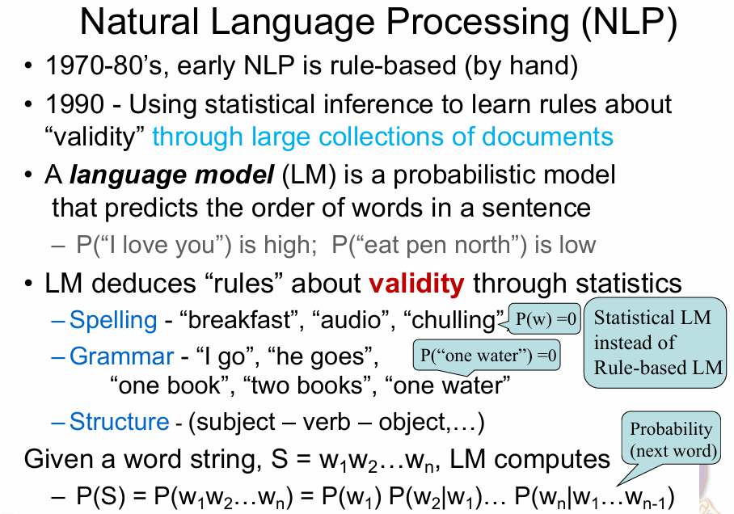
## 自然语言处理（NLP）概述

- 1970-80年代，早期的自然语言处理（NLP）是基于规则的（手动编写）。
- 1990年，使用统计推断方法通过大规模文档集合学习“有效性”规则。
- 语言模型（LM）是一种概率模型，用于预测句子中单词的顺序。
  - 例如：P(“I love you”) 的概率较高；P(“eat pen north”) 的概率较低。
- 语言模型通过统计数据推导出关于“有效性”的规则：
  - 拼写：例如“breakfast”，“audio”，“chulling”，其中P(“chulling”) = 0。
  - 语法：“I go”，“he goes”，“one book”，“two books”，“one water”。
  - 结构：（主语 - 谓语 - 宾语...）。
- 给定一个词串，S = w₁w₂…wn，LM计算：
  - P(S) = P(w₁w₂…wn) = P(w₁) P(w₂|w₁) … P(wn|w₁w₂…wn-1)。

---

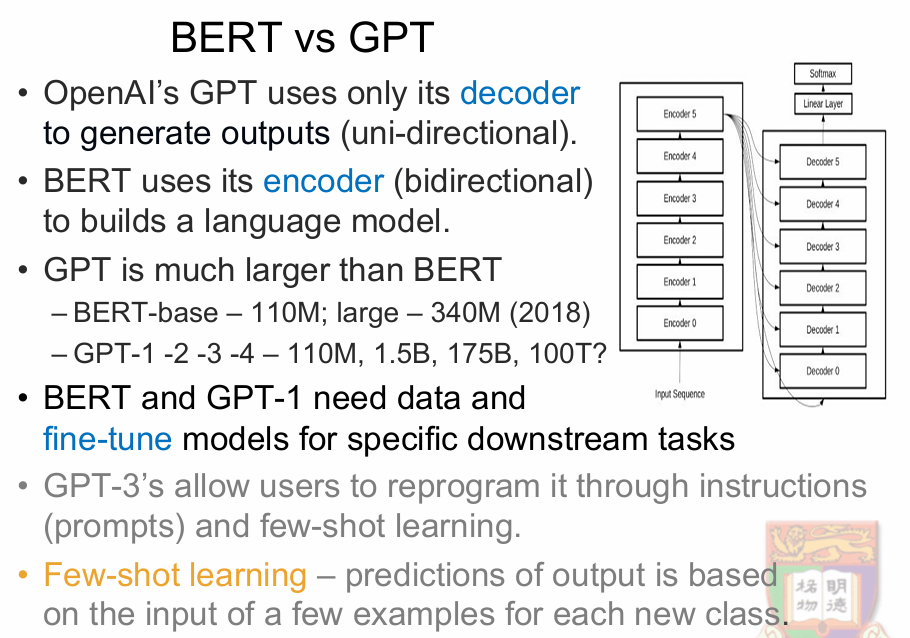
## BERT与GPT对比

- **GPT**使用解码器生成输出（单向）。
- **BERT**使用编码器（双向）来构建语言模型。
- **GPT的规模远大于BERT**：
  - BERT-base：110M；BERT-large：340M（2018年）。
  - GPT-1、2、3、4：110M、1.5B、175B、100T?
- **BERT与GPT-1**需要数据并微调模型以完成特定任务。
- **GPT-3**允许用户通过指令（提示）和少量学习来重新编程模型。
- **少量学习**：基于每个新类输入的少量示例，预测输出。

---

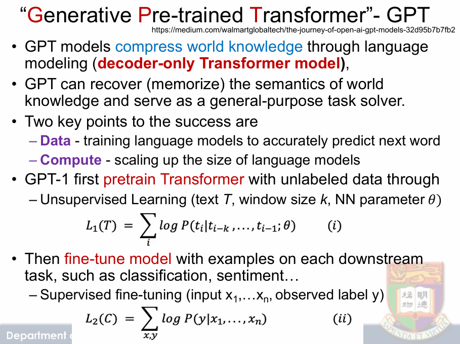
## GPT模型概述

- **GPT**代表“生成预训练变换器”（Generative Pre-trained Transformer），是通过语言建模（解码器部分）压缩世界知识的模型。
- GPT通过预训练来恢复（记忆）世界知识的语义，并作为通用任务求解器。
- GPT模型的成功依赖于两个关键因素：
  - **数据**：训练语言模型以准确预测下一个单词。
  - **计算**：扩大语言模型的规模。
- GPT-1通过无监督学习使用未标记数据进行Transformer预训练：
  - 无监督学习（文本T，窗口大小k，神经网络参数θ）。

公式：
- **L₁(T)**表示对文本T进行建模的损失函数：
  \[
  L_1(T) = \sum_i \log P(t_i | t_{i-k}, \dots, t_{i-1}; \theta)
  \]
- 然后，通过监督微调模型以处理每个下游任务，如分类、情感分析等：
  - **L₂(C)**表示微调时的损失函数：
  \[
  L_2(C) = \sum_{x,y} \log P(y | x_1, \dots, x_n)
  \]

### 限制：
- 需要大量标注数据来学习特定任务，这些数据通常不容易获得。
- 不能很好地推广到其他任务，除非它们已经为此进行了训练

---

# Section 2 Large Language Models
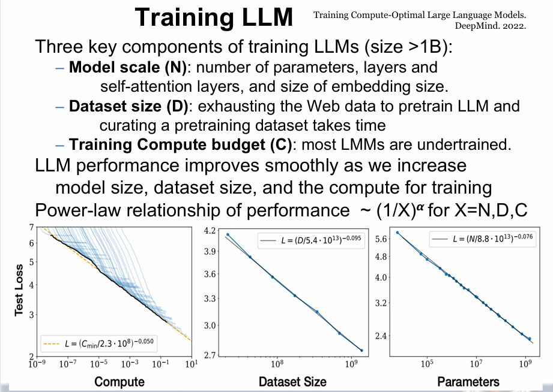
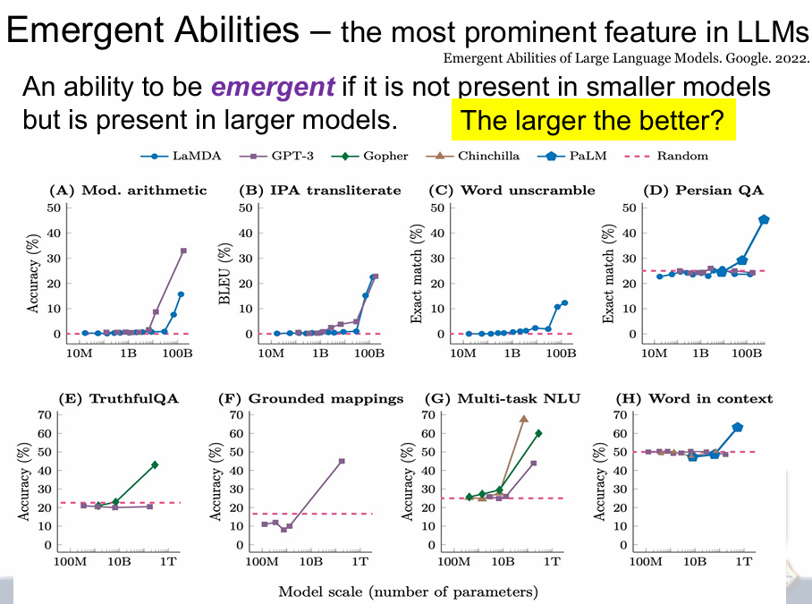
## 训练LLM

训练LLM（模型大小 > 1B）的三个关键组件：
- **模型规模（N）**：参数数量、层数、以及自注意力层和嵌入大小。
- **数据集大小（D）**：通过大量网络数据来预训练LLM并制作预训练数据集需要时间。
- **训练计算预算（C）**：大多数LLM的训练不足。
  
LLM的表现随着模型大小、数据集大小和计算预算的增加而平滑改善。性能的幂律关系：  
\[
L \sim (1/X)^{\alpha}, \text{ 其中X=N, D, C}
\]

## 新兴能力

新兴能力是LLM中最显著的特征——如果较小的模型中不存在某个能力，而在较大的模型中却存在该能力，它就被认为是新兴能力。  

**越大越好？**

不同规模的模型在不同任务上的表现（如数学推理、IPA音标转换、单词解密等），展示了新兴能力随模型规模增大而逐渐显现的趋势。  

---
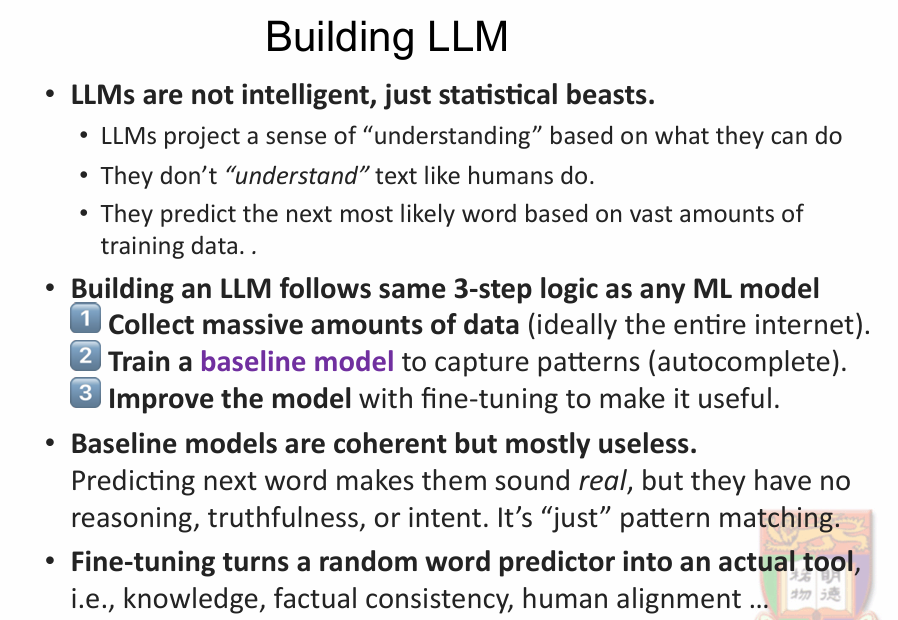

## 构建LLM

- **LLM并不具备智能，只有统计能力**：
  - LLM通过它们能够做的事情来投射出“理解”的感觉。
  - 它们并不像人类那样“理解”文本。
  - 它们基于大量训练数据预测下一个最可能的单词。

- **构建LLM遵循与任何机器学习模型相同的三步逻辑**：
  1. **收集大量数据**（理想情况下是整个互联网）。
  2. **训练基线模型**以捕捉模式（自动补全）。
  3. **通过微调改进模型**以使其更加实用。

- **基线模型一致但大多无用**：
  - 预测下一个单词使它们听起来很真实，但它们没有推理、真实性或意图。“它们仅仅是模式匹配。”

- **微调将随机的词预测器转化为实际工具**：
  - 即：知识、一致性、语义对齐、人类对齐等。

---
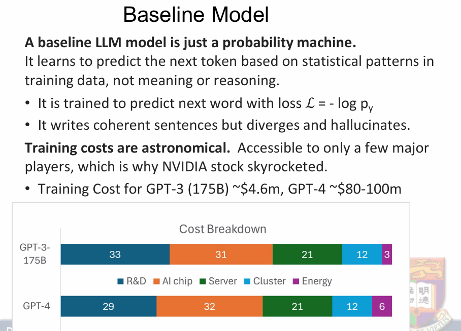
## 基线模型

- **基线LLM模型只是一个概率机器**：
  - 它学习根据训练数据中的统计模式来预测下一个token，而非理解或推理。
  - 它被训练预测下一个单词，损失函数为 \( L = - \log p_y \)。
  - 它写出连贯的句子，但可能会出现偏离和幻觉。

- **训练成本高得惊人**：只有少数大玩家能够负担得起，这也是为什么NVIDIA的股票飙升的原因。
  - **GPT-3（175B）的训练成本约为4.6百万美元**，**GPT-4约为8000万到1亿美元**。

### 成本分布：
- GPT-3-175B：
  - 研发：33%
  - AI芯片：31%
  - 服务器：21%
  - 集群：12%
  - 能源：3%
- GPT-4：
  - 研发：29%
  - AI芯片：32%
  - 服务器：21%
  - 集群：12%
  - 能源：6%

---

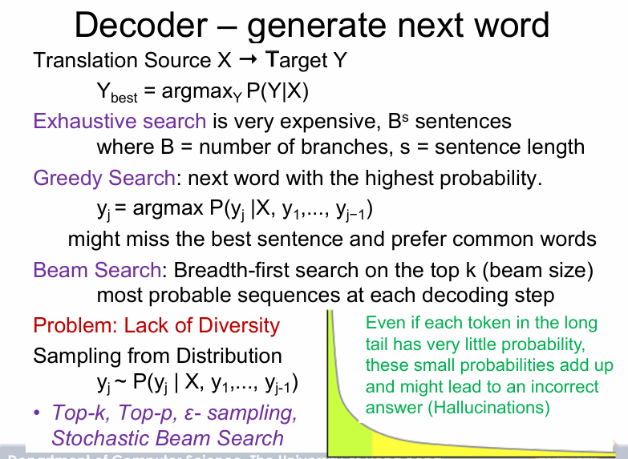

## 解码器 – 生成下一个单词

- **翻译源X → 目标Y**
  - \( Y_{\text{best}} = \arg \max_X P(Y|X) \)

- **穷举搜索**非常昂贵，\( B^s \) 个句子，其中B = 分支数量，s = 句子长度。

- **贪婪搜索**：选择概率最高的下一个单词。
  - \( y_j = \arg \max P(y_j | X, y_1, ..., y_{j-1}) \)
  - 可能错过最佳句子，偏向选择常见单词。

- **束搜索**：广度优先搜索，选择每个解码步骤中最可能的前k个序列。

### 问题：缺乏多样性
- 从分布中采样：\( y_j \sim P(y_j | X, y_1, ..., y_{j-1}) \)
  - **Top-k**、**Top-p**、**ε-采样**、**随机束搜索**

- **幻觉**：即使长尾中的每个token的概率很小，这些小概率相加可能会导致错误的答案。

---

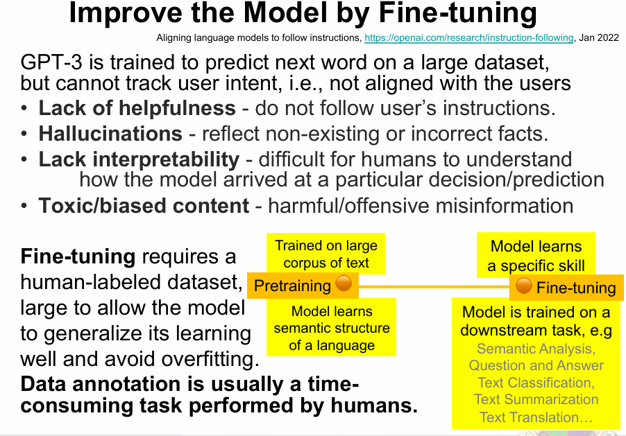

## 通过微调改进模型

- **GPT-3**被训练预测下一个单词，但无法跟踪用户意图，即与用户不对齐：
  - **缺乏帮助性**：无法遵循用户指令。
  - **幻觉**：反映不存在或错误的事实。
  - **缺乏可解释性**：人类难以理解模型是如何得出某个决策/预测的。
  - **有毒/偏见内容**：有害/冒犯性的错误信息。

**微调**需要一个人工标注的大型数据集，以允许模型将其学习进行推广，并避免过拟合。
- 数据标注通常是由人工执行的，且是一个耗时的任务。

### 预训练与微调：
- **预训练**：模型学习语言的语义结构。
- **微调**：模型被训练在特定下游任务上，例如：
  - 语义分析
  - 问答系统
  - 文本分类
  - 文本摘要
  - 文本翻译

---

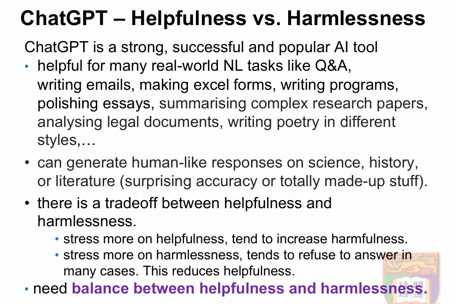
## ChatGPT – 有用性与无害性

- **ChatGPT**是一个强大、成功且流行的AI工具：
  - 在许多实际的自然语言任务中非常有用，如问答、写电子邮件、制作Excel表格、写程序、润色论文、总结复杂的研究论文、分析法律文件、用不同风格写诗等。
  - 可以生成类似人类的科学、历史或文学的回答（有时准确，或完全编造的内容）。

- 但是，**有用性与无害性之间存在权衡**：
  - **强调有用性**：可能会增加有害性。
  - **强调无害性**：可能会拒绝在许多情况下给出答案，从而降低有用性。

- 需要平衡**有用性**与**无害性**。

---

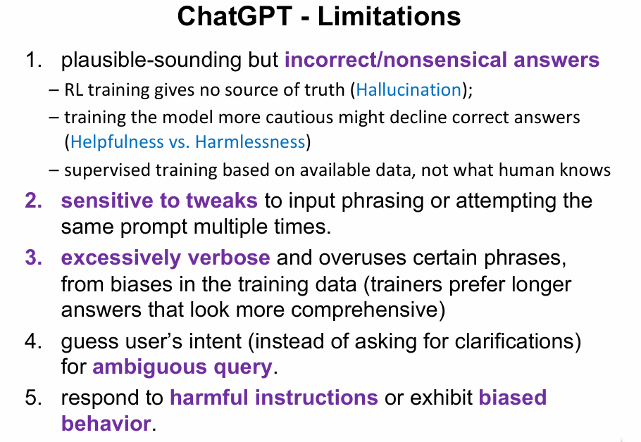
## ChatGPT的局限性

1. **似是而非的错误/荒谬回答**：
   - 强化学习（RL）训练没有真实来源（**幻觉**）。
   - 将模型训练得更加谨慎，可能会拒绝正确的答案（**有用性与无害性**）。
   - 监督训练基于可用数据，而不是人类所知道的内容。

2. **对输入措辞变化过于敏感**：尝试多次使用相同提示时，可能会产生不同的结果。

3. **过于冗长**：过度使用某些短语，偏向于训练数据中更长的、更详细的答案。

4. **猜测用户意图**：对于模糊的查询，可能会猜测用户的意图，而不是要求进一步澄清。

5. **响应有害指令或表现出偏见行为**：可能响应不当的指令或展示偏见的行为。

---

## 如何收集和清理训练数据

- **垃圾进，垃圾出**适用于LLM。
  - LLM需要大量、丰富且结构良好的训练数据才能有效。
  
- **LLM需要数万亿的token**，用于数万亿参数的模型：
  - GPT-4：1.8T参数，13T tokens（9.7T单词）
  - Deepseek V3：0.6T参数，15T tokens（11.1T单词）

- **并非所有互联网文本都值得使用**：
  - （45T -> 570G）网页格式化、垃圾邮件、重复内容、误导信息等。

- **公共爬虫**：杂乱、嘈杂、重复但开放，最大免费数据，250B页面（每月3-5B新页面）——Fineweb项目。

- **预训练不足**：收集和清理数据后，企业会进行精细化过滤和去重工作，在开始模型训练前确保数据的质量。

### 数据集：
| 数据集   | 大小（GB） | 训练权重 | epoch |
|--------|-----------|--------|-------|
| Wikipedia | 3         | 3%     | 3.40  |
| WebText  | 20        | 21%    | 2.90  |
| books    | 67        | 16%    | 2.33  |
| crawl    | 400       | 60%    | 0.44  |

---

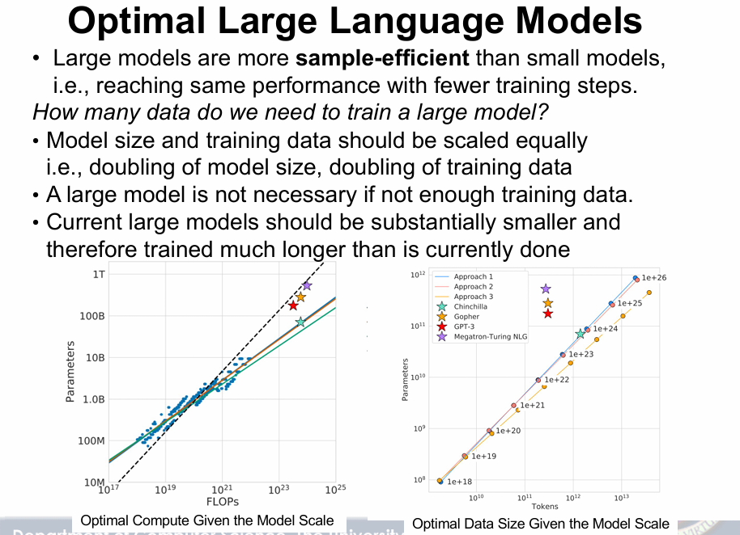

## 最优大型语言模型

- 大模型比小模型更**样本高效**，即使用更少的训练步骤就能达到相同的表现。
  - 问题：**训练大型模型需要多少数据？**

- **模型规模和训练数据应该同等扩展**：
  - 即：模型规模翻倍时，训练数据也需要翻倍。
  
- 如果没有足够的训练数据，大型模型不是必需的。

- 当前的大型模型应该大大缩小，因此需要比现在更长时间的训练。

### 性能与规模：
- 训练计算量与模型规模之间的关系：图表显示了不同方法和模型（例如Chinchilla、GPT-3、Megatron-Turing NLG）在不同参数和FLOP值下的训练表现。

---

# Section 3 GPT

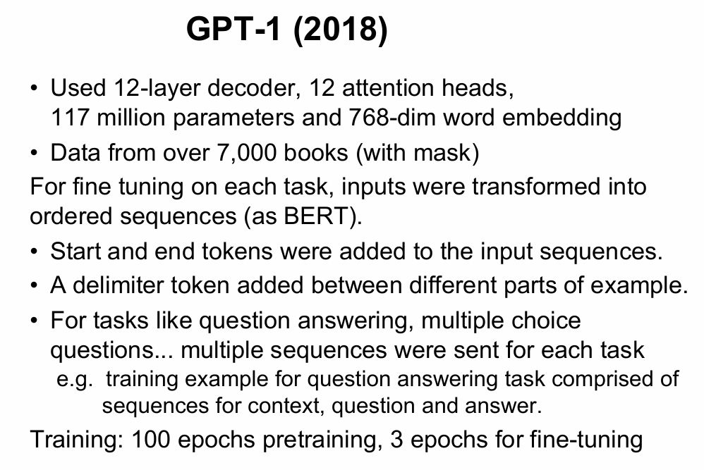S
## GPT-1 (2018)

- 使用12层解码器，12个注意力头，117百万参数和768维词嵌入。
- 数据来自超过7,000本书（使用掩码）。
- 在每个任务上的微调，输入被转化为有序序列（如BERT）。
  - 在输入序列中添加开始和结束token。
  - 在不同部分之间添加分隔符token。
  - 对于像问答、选择题这样的任务，针对每个任务发送多个序列，例如：
    - 问答任务的训练示例包括上下文、问题和答案序列。
- 训练：100个预训练epoch，3个微调epoch。

---
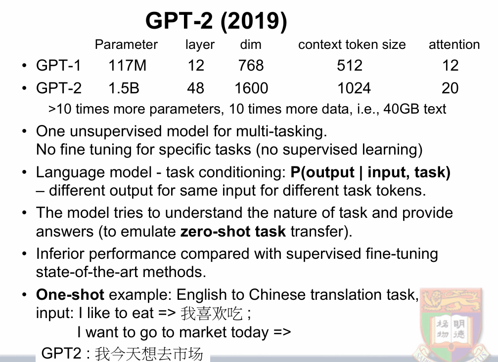
## GPT-2 (2019)

- GPT-1：117M参数，12层，768维嵌入，512的上下文token大小，12个注意力头。
- GPT-2：1.5B参数，48层，1600维嵌入，1024的上下文token大小，20个注意力头。
- GPT-2比GPT-1大10倍，数据量也增长10倍，即40GB文本。
- 一个无监督模型进行多任务处理。没有针对特定任务的微调（无监督学习）。
- 语言模型 - 任务条件：P(output | input, task)，即对于不同的任务token，相同输入会有不同输出。
- 模型试图理解任务的性质并提供答案（模拟零-shot任务转移）。
- 与监督微调方法相比，性能较差。

- **One-shot示例**：英语到中文的翻译任务：
  - 输入：I like to eat => 我喜欢吃；
  - I want to go to market today => GPT2：我今天想去市场。

## GPT-2模型规模与困惑度

- 使用117M、345M、762M和1.5B（GPT-2）参数训练了四个语言模型。
- 每个后续模型的表现都比前一个好。
- 性能（困惑度）随着参数数量的增加和相同数据集上更长的训练时间而提高。
  - 即，GPT-2对数据集进行了欠拟合。

---
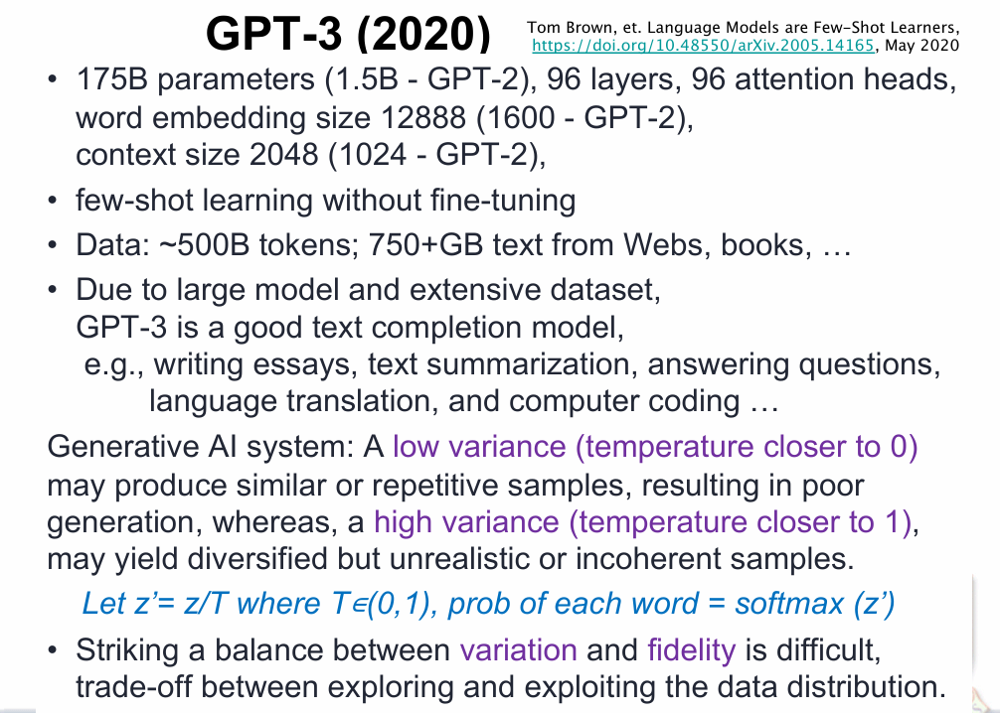
## GPT-3 (2020)

- 175B参数（1.5B - GPT-2），96层，96个注意力头，词嵌入大小12888（1600 - GPT-2），上下文大小2048（1024 - GPT-2）。
- 无需微调的少量学习。
- 数据：约500B tokens；750GB来自网页、书籍等。
- 由于大模型和丰富的数据集，GPT-3是一个优秀的文本生成模型，例如写文章、文本摘要、回答问题、语言翻译和计算机编程等。

- **生成式AI系统**：
  - **低方差**（温度接近0）可能会生成类似或重复的样本，导致较差的生成表现；
  - **高方差**（温度接近1）可能会产生多样化但不现实或不连贯的样本。

- **平衡方差与保真度**非常困难，需要在探索和利用数据分布之间进行权衡。

---
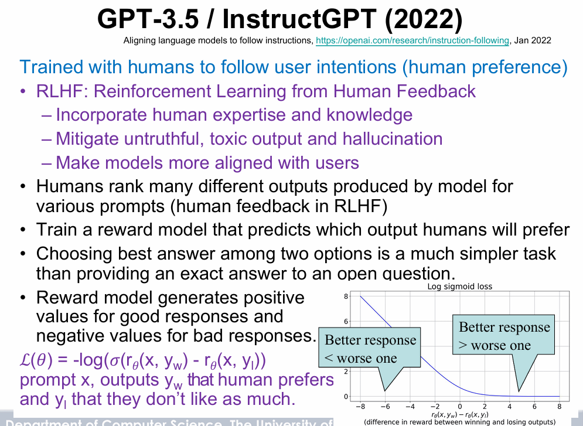
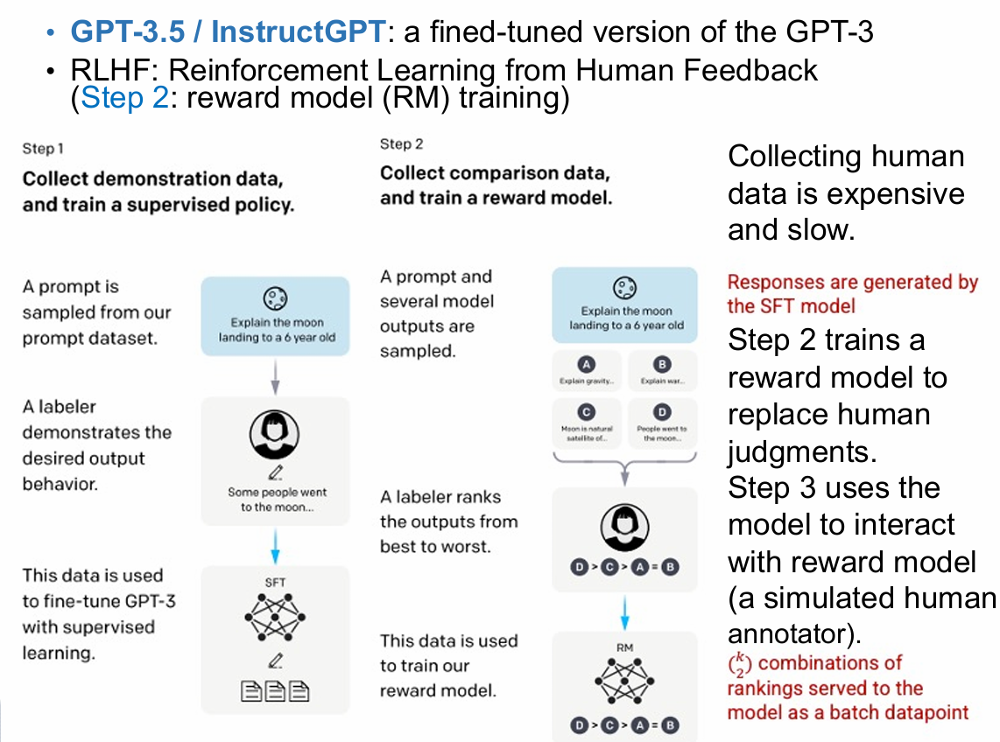
## GPT-3.5 / InstructGPT (2022)

- **训练目标**：让模型更好地遵循用户意图（人类偏好）
  - **RLHF**：来自人类反馈的强化学习（Reinforcement Learning from Human Feedback）。
  - 融入人类的专业知识和经验。
  - 缓解不真实、有毒的输出和幻觉（Hallucination）。
  - 使模型与用户更为对齐。
  
- **人类为不同提示生成的多个输出排名**（人类反馈在RLHF中的作用）。
- **奖励模型**：训练一个奖励模型来预测哪些输出会更受用户偏好，选择最佳答案比提供完全正确的答案要简单得多。

### 训练步骤：
1. **收集示范数据**并训练一个监督策略（SFT）。
2. **收集比较数据**并训练奖励模型（RM）。

---

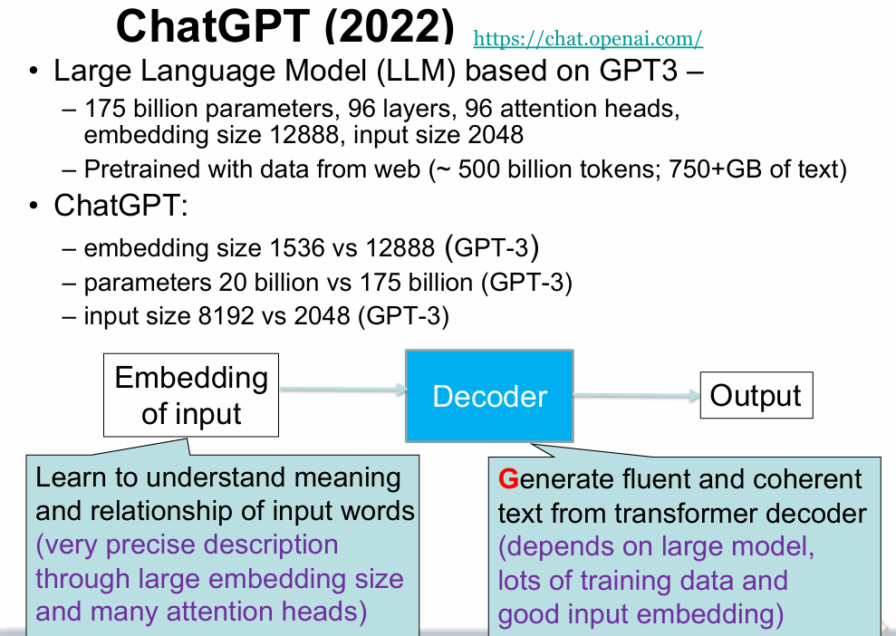
- **ChatGPT (2022)**：基于GPT-3的大型语言模型（LLM）。
  - 1750亿参数，96层，96个注意力头，嵌入大小12888，输入大小2048。
  - 预训练：来自网页、书籍等的数据（约500B tokens，750GB文本）。
  - **嵌入输入**，**解码输出**。
  - 学习理解输入词的含义和关系（通过大规模的嵌入和多注意力头）。

---

## ChatGPT 大热

- **ChatGPT**：5天内获得100万用户，2个月内获得超过1亿月活跃用户。
  - TikTok用了9个月达到1亿用户，而ChatGPT在15天内达成这一目标。
  - **GPT-3.5**模型通过RLHF训练与人类互动来优化对话性能。

- **对话协议微调**：
  - 用户输入：Hi! I am a human。
  - 助手：Hello! Nice to meet you! I am ChatGPT, your AI assistant.
  - 创建新token来表示行为，例如使用OpenAI系统token `<lim_start>`和`<lim_end>`。

- **基于InstructGPT**，ChatGPT在训练过程中融入了人类反馈，通过RLHF收集数据并专门为对话优化。

---
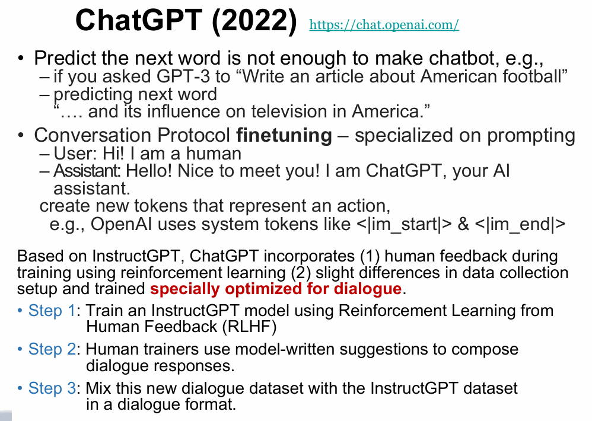
## ChatGPT (2022)

- **预测下一个单词**并不足以制作聊天机器人，例如，如果你要求GPT-3“写一篇关于美国足球的文章”，它会预测下一个单词，如“...以及它对美国电视的影响”。
  
- **对话协议微调** - 专门针对提示进行优化：
  - 用户：Hi! I am a human
  - 助手：Hello! Nice to meet you! I am ChatGPT, your AI assistant.
  - 创建新token来表示行为，例如，OpenAI使用系统token `<lim_start>`和`<lim_end>`。

- 基于**InstructGPT**，ChatGPT在训练过程中融入了（1）人类反馈（通过强化学习）和（2）数据收集设置的轻微差异，特别为对话进行优化。

### 训练步骤：
1. **训练InstructGPT模型**：通过人类反馈的强化学习（RLHF）。
2. **人类训练者**使用模型书面建议来构建对话回应。
3. **混合新数据集**：将这个新对话数据集与InstructGPT数据集合并，采用对话格式。

---

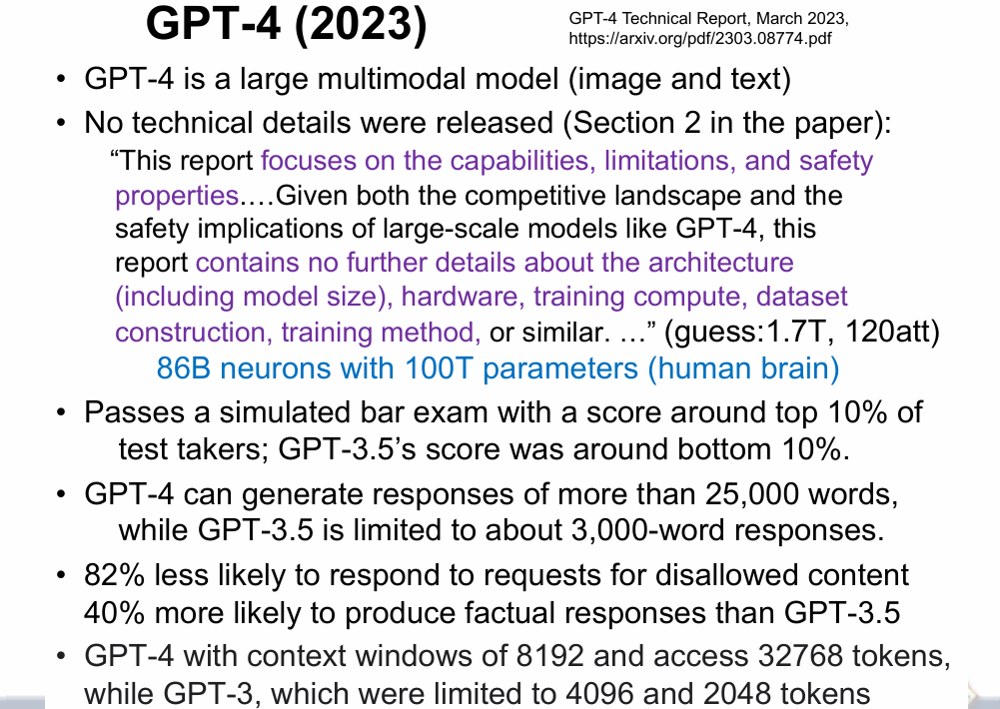

## GPT-4 (2023)

- **GPT-4**是一个大型的多模态模型（处理图像和文本）。
- 未公开技术细节，但报告重点介绍了其能力、局限性和安全性特性。
  - **模型参数**：约100T参数，包含86B个神经元（与人脑类似）。
- GPT-4通过模拟考试得分进入前10%（GPT-3.5的分数位于底部10%）。
- **生成文本**：GPT-4可以生成超过25,000个单词的响应，而GPT-3.5仅限于大约3,000个单词的响应。
- **表现**：GPT-4比GPT-3.5更少响应不允许的内容请求，生成的正确答案更多。

- **GPT-4的上下文窗口**为8192个token，访问32768个token，而GPT-3的限制为4096和2048个token。

---

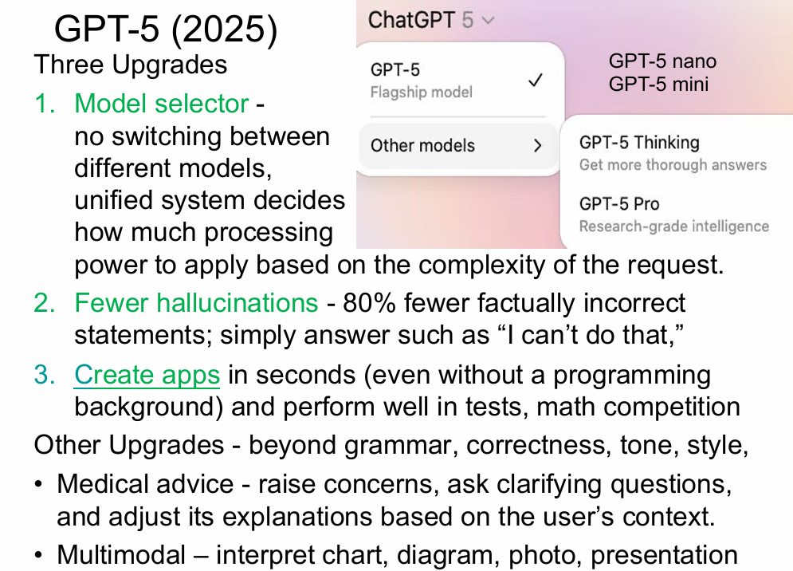
## GPT-5 (2025)

### 三个主要升级：

1. **模型选择器**：不再在不同模型之间切换，统一的系统根据请求的复杂性决定要应用多少处理能力。
2. **更少的幻觉**：事实性错误的声明减少80%；简单回答像“我不能做这个”。
3. **秒级应用创建**：即使没有编程背景，也能在几秒钟内创建应用，并在测试、数学竞赛中表现出色。

### 其他升级：
- **医疗建议**：能够提出担忧、询问澄清问题，并根据用户的上下文调整解释。
- **多模态**：解释图表、图像、照片、展示等。

