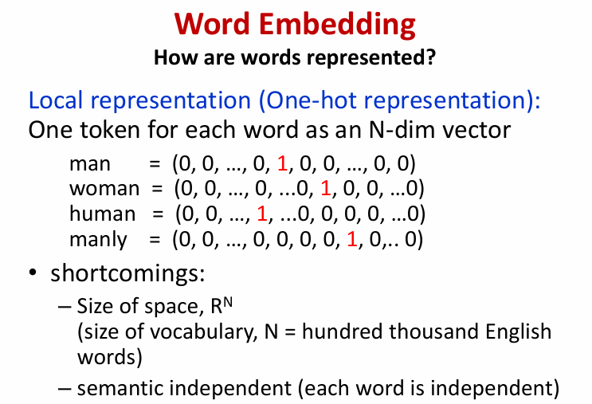
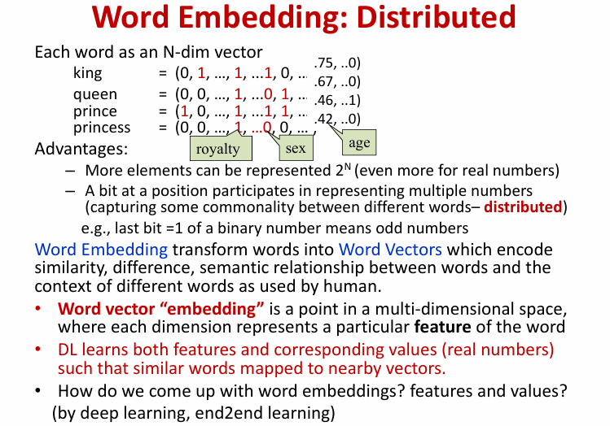
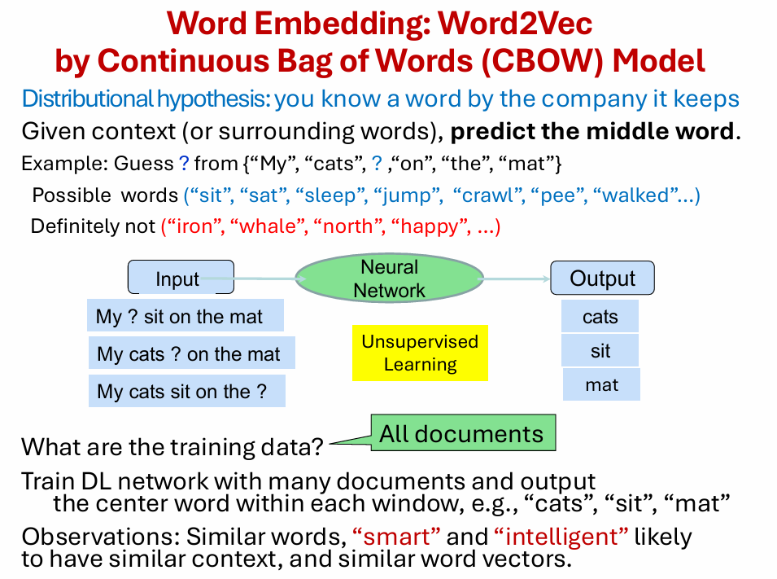
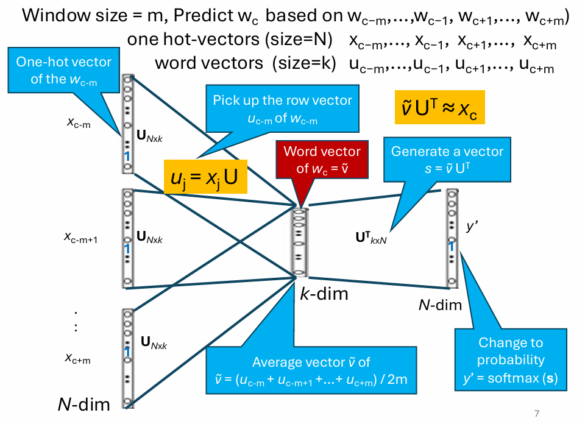
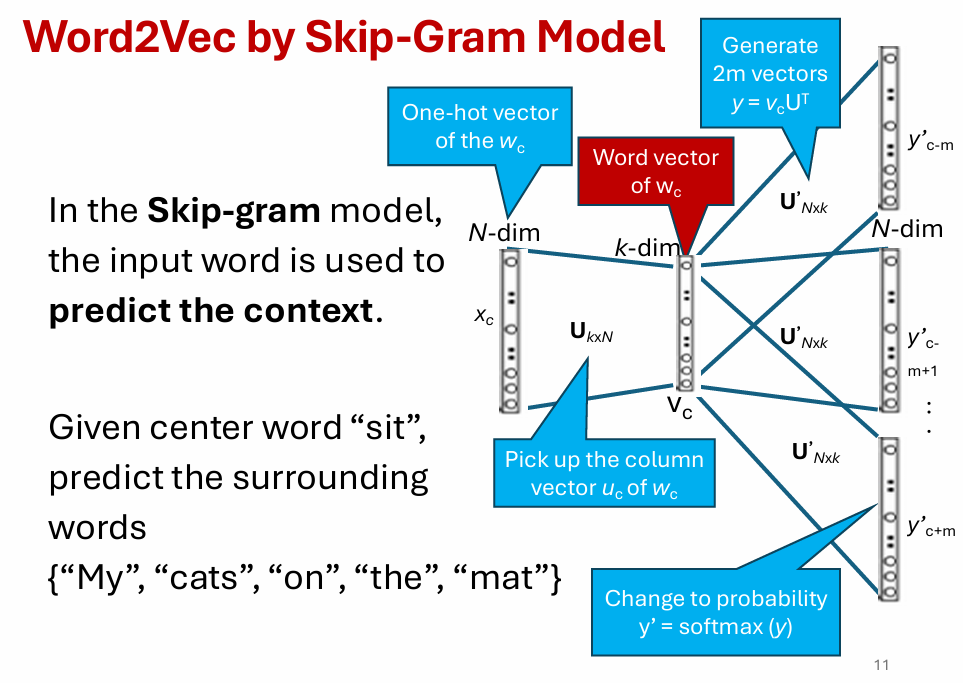
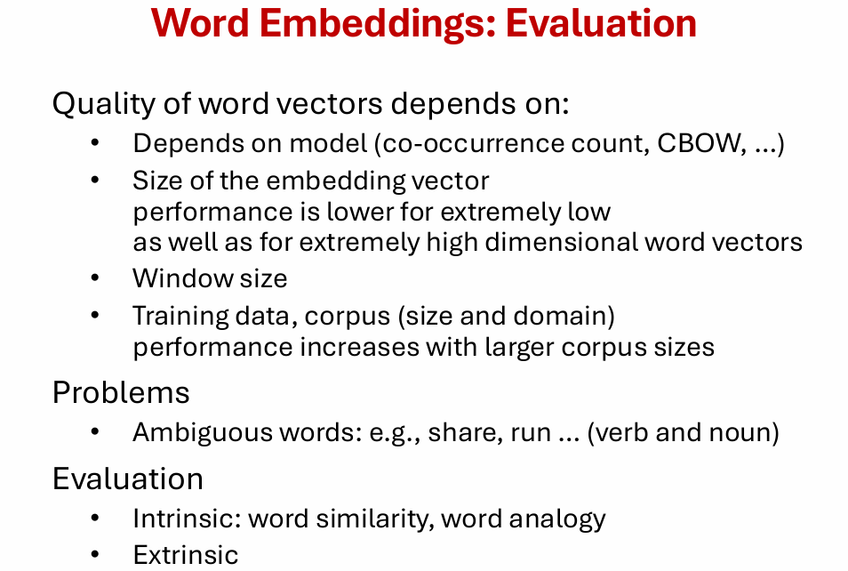
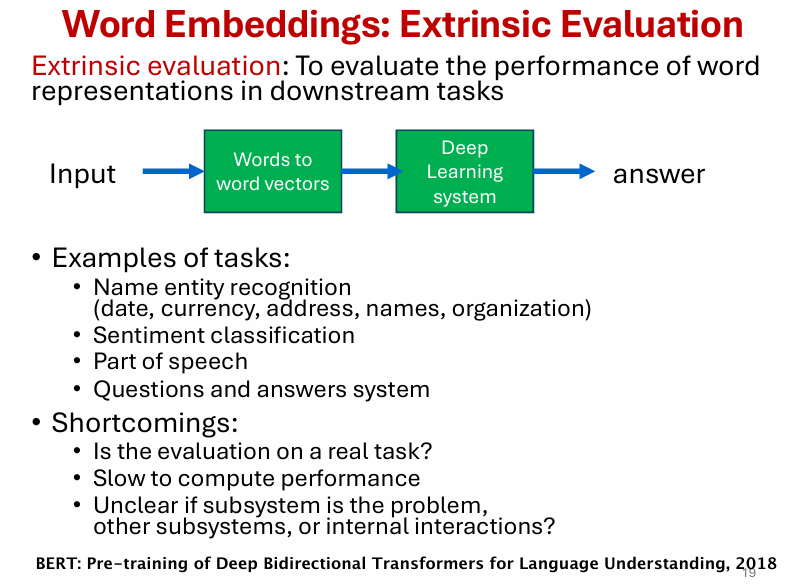
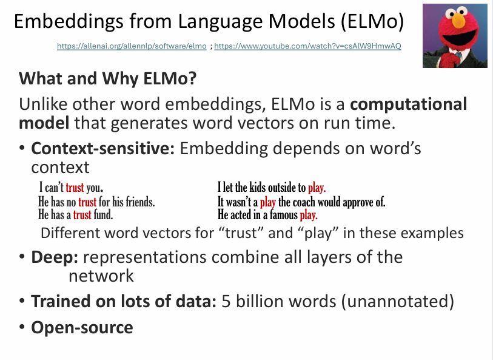
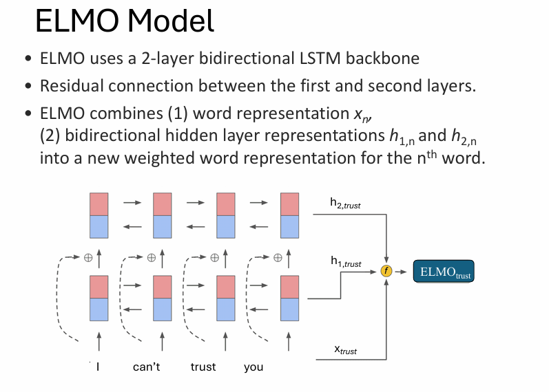

# DASC7606 Final - Natural Language Processing - summerized by hyperloop

# Section 0 Exam Scope

---
# Section 1 Continuous Bag-of-Words

### 词向量表示（Word Embedding）引入：词是怎么被表示的？

- **局部表示 / One-hot 表示（Local representation / One-hot）**
  - 词表大小为 \(N\)，每个词用一个 \(N\) 维向量表示
  - **规则**：只有对应词的位置为 1，其余全为 0  
    - man   = \((0,0,\dots,1,\dots,0)\)  
    - woman = \((0,0,\dots,1,\dots,0)\)（在另一个索引位置为 1）  
    - human / manly 同理

- **One-hot 的主要缺点（shortcomings）**
  - **维度极高**：向量空间是 \(\mathbb{R}^N\)，而 \(N\)≈词表大小（英语可达几十万），存储与计算成本高。
  - **语义无关 / 互相独立**：任意两个不同词的 one-hot 向量正交，无法表达
    “man 与 woman 更接近、man 与 table 更远”这类**语义相似性**。

---

### 分布式词表示（Distributed Word Embedding）

- **核心：每个词用一个“稠密”的 N 维向量表示**
  - 不再是 one-hot 的单个 1，而是多个维度都有非零值（常为实数）
  - 例：king / queen / prince / princess 在不同维度上有不同权重  
    这些维度可理解为某些潜在语义特征（如 *royalty*、*sex*、*age* 等）

- **优势（Advantages）**
  - **表达能力强**：若用二进制位表示，N 位可表示 \(2^N\) 种组合（若是实数则更丰富）
  - **“分布式”含义**：一个维度（一个位置的值）可以参与表示很多词；多个维度共同编码词的含义  
    → 能捕捉不同词之间的共性与差异
  - **能表示语义相似性与关系**：相似词的向量距离更近（nearby vectors），还能体现语义方向（如性别/年龄等差异）

- **Word Embedding 的定义**
  - **词向量/嵌入（embedding）**：多维空间中的一个点；每个维度对应某种（可学习的）特征
  - **深度学习会同时学到**
    - “有哪些特征”（features）
    - 以及各词在这些特征上的取值（values，通常为实数）
  - 训练后：**相似词 → 映射到相近向量**，并编码词与上下文中的语义关系

- **怎么得到这些 embedding？**
  - 通过深度学习的端到端学习（end-to-end learning）从数据中自动学习。

---

# Section 2 Continuous Bag-of-Words

## CBOW (Continuous Bag-of-Words) 模型介绍

### 核心思想

CBOW 是一种用于学习词向量的神经网络模型。它的目标是通过一个词的**上下文**（即它周围的词）来**预测这个词本身**。你可以把它想象成一个"填空"游戏：给你一句话中某个词前后的几个词，让你猜出中间被挖空的这个词是什么。

### 模型结构

1. **输入层**：

   - 将目标词周围的多个上下文词的 **One-hot 编码** 作为输入
   - 例如，对于句子 "The quick brown fox jumps"，若以 "fox" 为目标词，上下文窗口大小为2，则输入词为 ["quick", "brown", "jumps"]
2. **投影层**：

   - 每个输入的 One-hot 向量与一个共享的**输入权重矩阵**（即词嵌入矩阵）相乘，得到各自的词向量
   - 将这些上下文词向量**求和**或**平均**，形成一个单一的向量表示
3. **输出层**：

   - 将投影层得到的向量通过另一个**输出权重矩阵**
   - 经过 softmax 函数，得到词汇表中每个词作为目标词的概率分布

### 优点

- 对高频词训练效果较好
- 训练速度相对较快（相比于 Skip-gram）
- 能很好地捕捉词语的语义信息

### 缺点

- 对低频词的处理不如 Skip-gram
- 上下文词顺序信息被忽略（通过求和/平均操作）

### Advantages

- Effective for high-frequency words
- Relatively faster training (compared to Skip-gram)
- Good at capturing semantic information

### Disadvantages

- Less effective for rare words compared to Skip-gram
- Word order information is ignored (due to sum/average operation)

### Comparison with Skip-gram

| Feature                                 | CBOW                              | Skip-gram                               |
| --------------------------------------- | --------------------------------- | --------------------------------------- |
| **Training Objective**            | Predict target word from context  | Predict context words from target word  |
| **Training Speed**                | Faster                            | Slower                                  |
| **Performance on Rare Words**     | Worse                             | Better                                  |
| **Performance on Frequent Words** | Better                            | Good                                    |
| **Typical Use Case**              | Smaller datasets, faster training | Larger datasets, better overall quality |

---

# Section 3 Skip-gram 

### 核心思想

Skip-gram 是一种用于学习词向量的神经网络模型。与 CBOW 相反，它的目标是通过一个**中心词**来预测其周围的**上下文词**。你可以把它想象成一个"预测邻居"的任务：给你一个中心词，让你预测它附近可能出现的其他词。

### 模型结构

1. **输入层**：

   - 将中心词的 **One-hot 编码** 作为输入
   - 例如，对于句子 "The quick brown fox jumps"，若以 "fox" 为中心词，输入就是 "fox" 的 One-hot 编码
2. **投影层**：

   - 输入的中心词 One-hot 向量与**输入权重矩阵**相乘，得到中心词的词向量表示
   - 这个向量直接作为隐藏层表示
3. **输出层**：

   - 将隐藏层向量通过**输出权重矩阵**
   - 经过 softmax 函数，得到词汇表中每个词作为上下文词的概率分布
   - 模型会为窗口内的每个上下文位置生成独立的预测

### 优点

- 对低频词的效果更好
- 能更有效地利用训练数据
- 在小数据集上表现更优秀
- 能捕捉更精细的语义关系

### 缺点

- 训练速度相对较慢
- 对高频词可能过拟合
- 需要更多的训练数据来达到最佳效果

### Advantages

- Better performance on rare words
- More efficient use of training data
- Better performance on smaller datasets
- Captures finer semantic relationships

### Disadvantages

- Relatively slower training speed
- May overfit on high-frequency words
- Requires more training data for optimal results

## Comparison

| Feature                                 | Skip-gram                              | CBOW                               |
| --------------------------------------- | -------------------------------------- | ---------------------------------- |
| **Training Objective**            | Predict context from center word       | Predict center word from context   |
| **Training Speed**                | Slower                                 | Faster                             |
| **Performance on Rare Words**     | Better                                 | Worse                              |
| **Performance on Frequent Words** | Good                                   | Better                             |
| **Data Efficiency**               | More efficient                         | Less efficient                     |
| **Typical Use Case**              | Smaller datasets, rare words important | Larger datasets, speed prioritized |

---
# Section 4 Word Embeddings: Evaluation 

### 词向量（Word Embeddings）评估：质量受什么影响？

- **词向量质量依赖因素**
  - **训练方法/模型**：如共现统计（co-occurrence count）、CBOW 等
  - **向量维度大小（embedding size）**：太低表达力不足；太高可能带来噪声/过拟合，表现反而下降
  - **上下文窗口大小（window size）**：窗口影响“语义 vs 句法”信息捕捉范围
  - **训练语料（corpus）规模与领域**：语料越大通常效果越好；领域匹配也很关键

- **典型问题（Problems）**
  - **一词多义/歧义词（Ambiguous words）**：如 *share*、*run* 既可作名词也可作动词  
    → 单个静态词向量难以同时表达不同含义

- **评估方式（Evaluation）**
  - **内在评估（Intrinsic）**：直接测词向量本身  
    - 词相似度（word similarity）
    - 词类比（word analogy，如 king - man + woman ≈ queen）
  - **外在评估（Extrinsic）**：放到下游任务中看效果（如分类、检索、NER 等）

---

### 词向量：外在评估（Extrinsic Evaluation）

- **定义**：把词表示（word embeddings）放进**下游任务**的完整系统里，通过任务表现来评估词向量质量  
  流程：Input → **Words to word vectors** → **Deep Learning system** → answer

- **典型下游任务示例**
  - **命名实体识别（NER）**：识别人名、地名、组织、日期、货币、地址等
  - **情感分类（Sentiment classification）**
  - **词性标注（Part-of-Speech tagging, POS）**
  - **问答系统（Question Answering, QA）**

- **外在评估的不足（Shortcomings）**
  - **是否真正在评估“词向量”？**：结果受下游模型结构、训练策略等影响，未必只反映 embedding 好坏
  - **计算成本高/评估慢**：需要训练完整任务模型才能比较
  - **难定位问题来源**：性能差可能来自 embedding，也可能来自其他子模块或模块间交互（internal interactions）

- **关联**：BERT（2018）等预训练方法常通过多种下游任务表现来检验表示学习效果。

---

# Section 5 ELMo 

### 什么是ELMo？

ELMo（Embeddings from Language Models）是由AllenNLP在2018年提出的深度语境化词表示模型。它的核心创新是**为每个词生成依赖于上下文的向量表示**，解决了传统词向量（如Word2Vec）的"一词一向量"局限性。

### 核心思想

"一词多义"解决方案：同一个词在不同语境中应有不同表示。例如：

- "苹果"手机 vs "苹果"水果
- "银行"存款 vs 河岸"银行"

### 技术特点

- **双向语言模型**：同时考虑左上下文和右上下文
- **多层LSTM结构**：从浅层到深层捕获不同层次的语言信息
- **特征组合**：将所有层的表示线性组合为最终向量
- **预训练+微调**：在大规模语料预训练，在下游任务微调

### 三层表示含义

1. **底层LSTM**：捕获句法特征（词性、形态）
2. **中层LSTM**：捕获浅层语义
3. **顶层LSTM**：捕获深层语义和语境信息

### What is ELMo?

ELMo (Embeddings from Language Models) is a deep contextualized word representation model proposed by AllenNLP in 2018. Its core innovation is **generating context-dependent vector representations for each word**, solving the "one vector per word" limitation of traditional word embeddings like Word2Vec.

### Core Idea

Solution for polysemy: The same word should have different representations in different contexts. For example:

- "Apple" phone vs "apple" fruit
- "Bank" deposit vs river "bank"

### Technical Features

- **Bidirectional Language Model**: Considers both left and right context
- **Multi-layer LSTM Architecture**: Captures linguistic information at different levels from shallow to deep
- **Feature Combination**: Linearly combines representations from all layers as final vector
- **Pre-training + Fine-tuning**: Pre-trained on large corpus, fine-tuned for downstream tasks

### Three-layer Representation Meaning

1. **Bottom LSTM**: Captures syntactic features (POS, morphology)
2. **Middle LSTM**: Captures shallow semantics
3. **Top LSTM**: Captures deep semantics and contextual information
